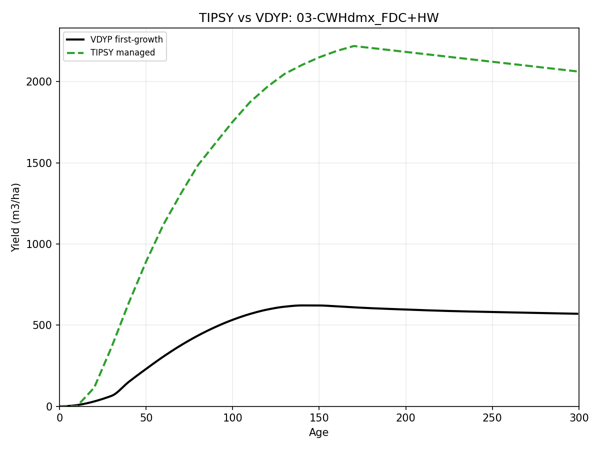
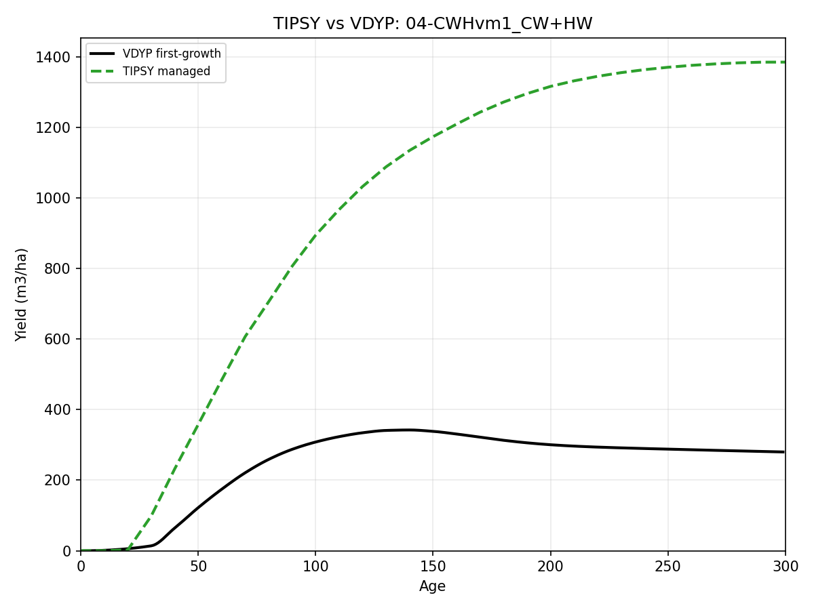
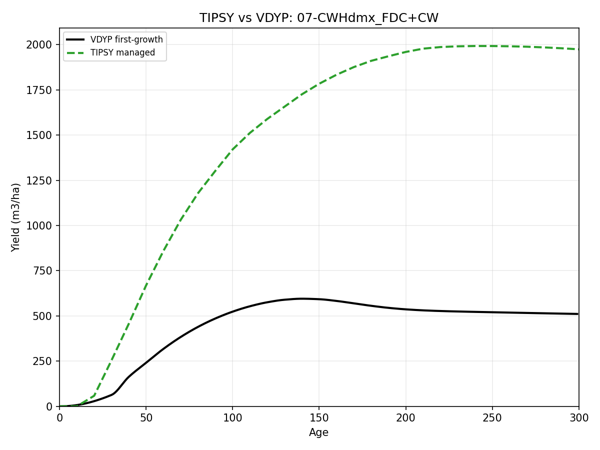
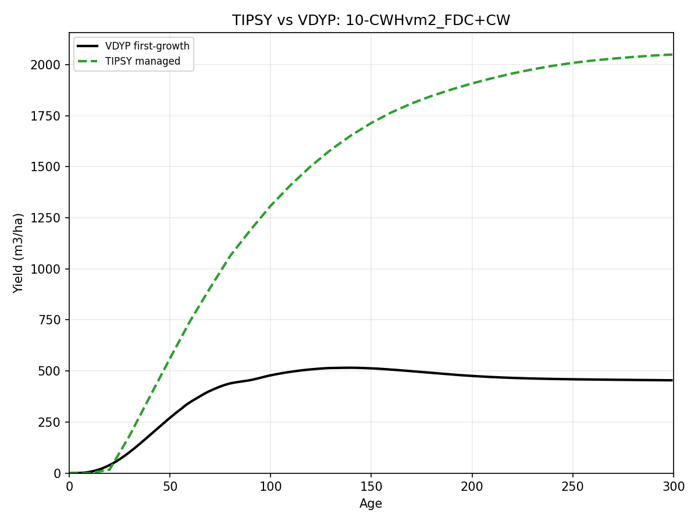
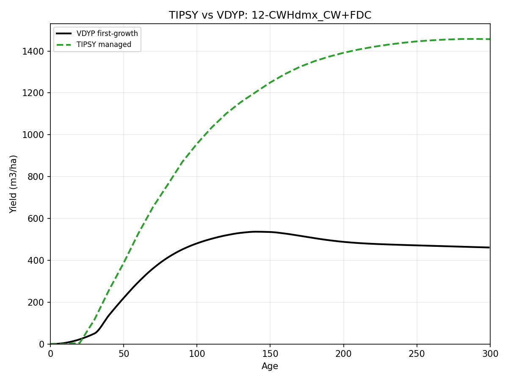
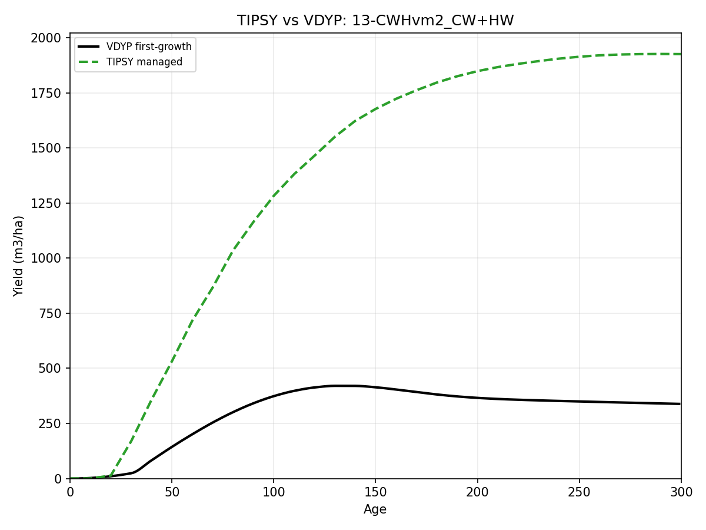
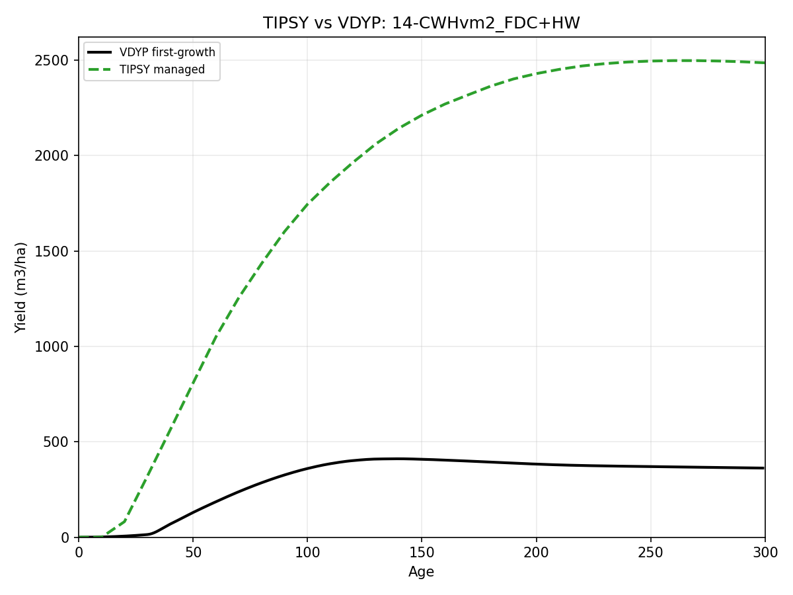
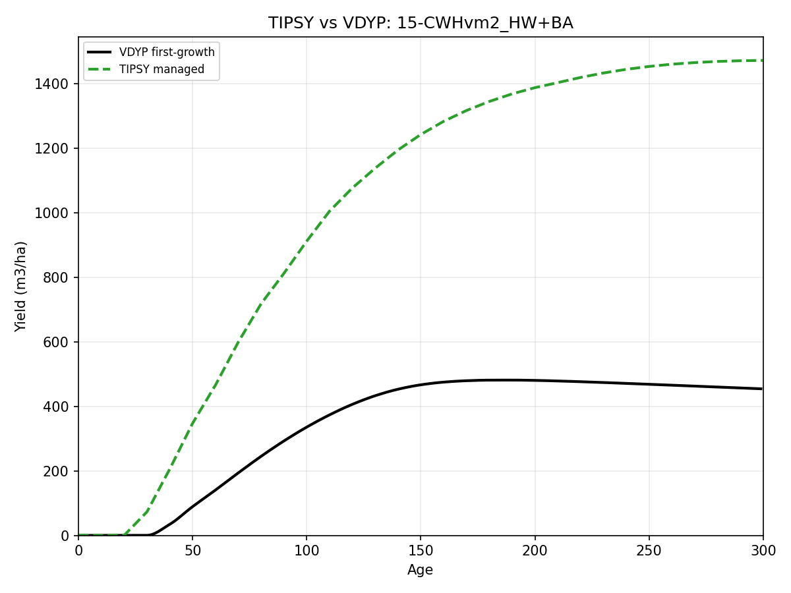
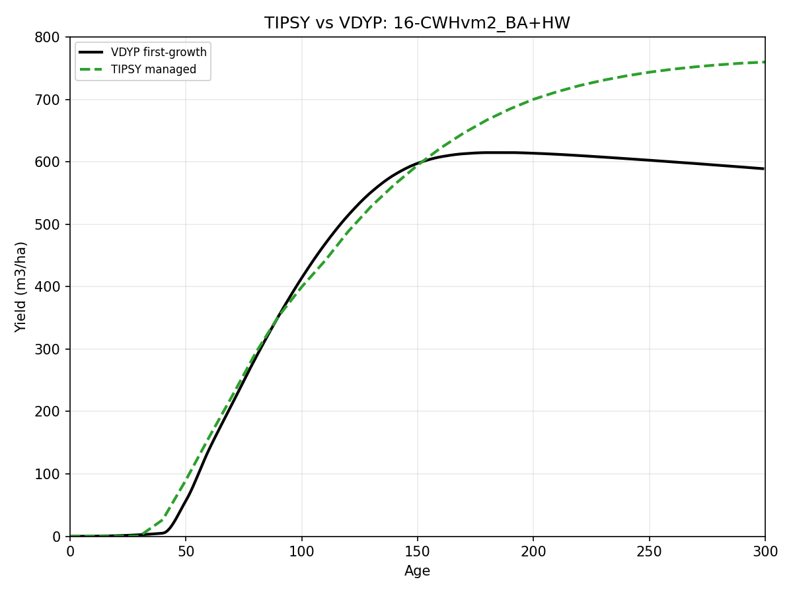
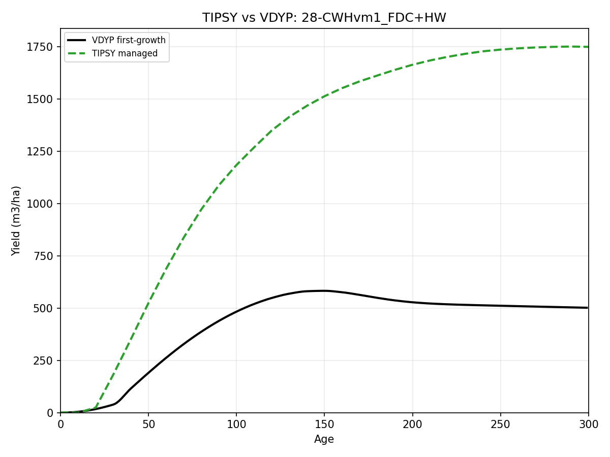

Yield Curve Comparisons
=======================

Purpose
-------

This page surfaces the current MKRF treated-yield comparison figures directly
from the checked-in ``plots/`` artifacts.

Use this page when you want to answer questions such as:

- which current MKRF strata/AUs have treated TIPSY-vs-VDYP overlay figures;
- how the treated curve shape differs from the natural-reference curve; and
- whether the currently published managed-curve story looks plausible at a
  quick visual level.

For the underlying logic behind those figures, use:

- :doc:`analysis-units-and-yield-curves`
- :doc:`treatments-and-state-logic`

How To Read These Figures
-------------------------

- Treat each figure as one checked-in treated overlay artifact.
- Focus first on broad shape: early growth, peak timing, and whether the two
  curves stay close or diverge strongly at older ages.
- Use the figures as interpretation aids, not as substitutes for the canonical
  XML, tracks, or runtime accounts.
- For the broader plot catalog, use :doc:`figure-appendix`.

Current TIPSY-vs-VDYP Gallery
-----------------------------

.. figure:: _static/mkrf-figures/tipsy_vdyp_tsamkrf-00-CWHvm1_HW+CW.png
   :alt: tipsy_vdyp_tsamkrf-00-CWHvm1_HW+CW.png
   :width: 90%

   Treated TIPSY-vs-VDYP overlay for ``00-CWHvm1_HW+CW``.

.. figure:: _static/mkrf-figures/tipsy_vdyp_tsamkrf-01-CWHvm2_HW+CW.png
   :alt: tipsy_vdyp_tsamkrf-01-CWHvm2_HW+CW.png
   :width: 90%

   Treated TIPSY-vs-VDYP overlay for ``01-CWHvm2_HW+CW``.

.. figure:: _static/mkrf-figures/tipsy_vdyp_tsamkrf-02-CWHdmx_HW+CW.png
   :alt: tipsy_vdyp_tsamkrf-02-CWHdmx_HW+CW.png
   :width: 90%

   Treated TIPSY-vs-VDYP overlay for ``02-CWHdmx_HW+CW``.

   Treated TIPSY-vs-VDYP overlay for ``03-CWHdmx_FDC+HW``.

   Treated TIPSY-vs-VDYP overlay for ``04-CWHvm1_CW+HW``.

.. figure:: _static/mkrf-figures/tipsy_vdyp_tsamkrf-05-CWHdmx_HW+FDC.png
   :alt: tipsy_vdyp_tsamkrf-05-CWHdmx_HW+FDC.png
   :width: 90%

   Treated TIPSY-vs-VDYP overlay for ``05-CWHdmx_HW+FDC``.

.. figure:: _static/mkrf-figures/tipsy_vdyp_tsamkrf-06-CWHvm2_HW+FDC.png
   :alt: tipsy_vdyp_tsamkrf-06-CWHvm2_HW+FDC.png
   :width: 90%

   Treated TIPSY-vs-VDYP overlay for ``06-CWHvm2_HW+FDC``.

   Treated TIPSY-vs-VDYP overlay for ``07-CWHdmx_FDC+CW``.

.. figure:: _static/mkrf-figures/tipsy_vdyp_tsamkrf-08-CWHdmx_CW+HW.png
   :alt: tipsy_vdyp_tsamkrf-08-CWHdmx_CW+HW.png
   :width: 90%

   Treated TIPSY-vs-VDYP overlay for ``08-CWHdmx_CW+HW``.

.. figure:: _static/mkrf-figures/tipsy_vdyp_tsamkrf-09-CWHvm1_HW+FDC.png
   :alt: tipsy_vdyp_tsamkrf-09-CWHvm1_HW+FDC.png
   :width: 90%

   Treated TIPSY-vs-VDYP overlay for ``09-CWHvm1_HW+FDC``.

   Treated TIPSY-vs-VDYP overlay for ``10-CWHvm2_FDC+CW``.

   Treated TIPSY-vs-VDYP overlay for ``12-CWHdmx_CW+FDC``.

   Treated TIPSY-vs-VDYP overlay for ``13-CWHvm2_CW+HW``.

   Treated TIPSY-vs-VDYP overlay for ``14-CWHvm2_FDC+HW``.

   Treated TIPSY-vs-VDYP overlay for ``15-CWHvm2_HW+BA``.

   Treated TIPSY-vs-VDYP overlay for ``16-CWHvm2_BA+HW``.

   Treated TIPSY-vs-VDYP overlay for ``28-CWHvm1_FDC+HW``.

.. figure:: _static/mkrf-figures/tipsy_vdyp_tsamkrf-29-CWHvm2_BA+CW.png
   :alt: tipsy_vdyp_tsamkrf-29-CWHvm2_BA+CW.png
   :width: 90%

   Treated TIPSY-vs-VDYP overlay for ``29-CWHvm2_BA+CW``.

Where These Figures Come From
-----------------------------

- published figure assets for this page live under
  ``docs/_static/mkrf-figures/`` in this instance checkout;
- the overlays on this page are copied from the checked-in MKRF treated
  comparison artifacts for standalone docs publication;
- the canonical AU selection and non-top-N runtime remap logic behind those
  overlays is explained in :doc:`analysis-units-and-yield-curves`;
- the broader strata/VDYP catalog is rendered in :doc:`figure-appendix`; and
- rebuild/QA guidance for the canonical release lane lives in
  :doc:`rebuild-and-qa` and :doc:`operator-runbook`.
